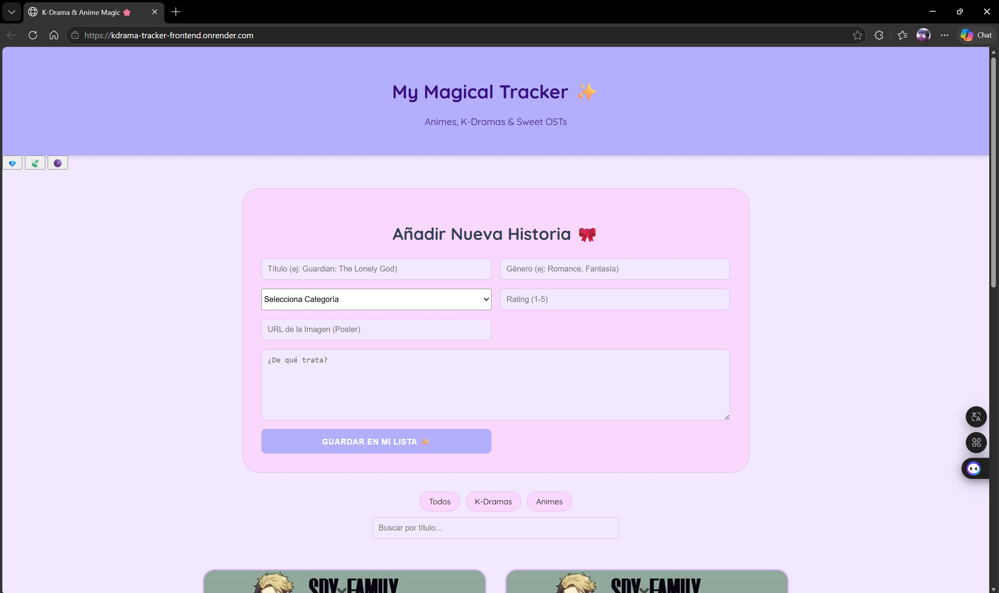
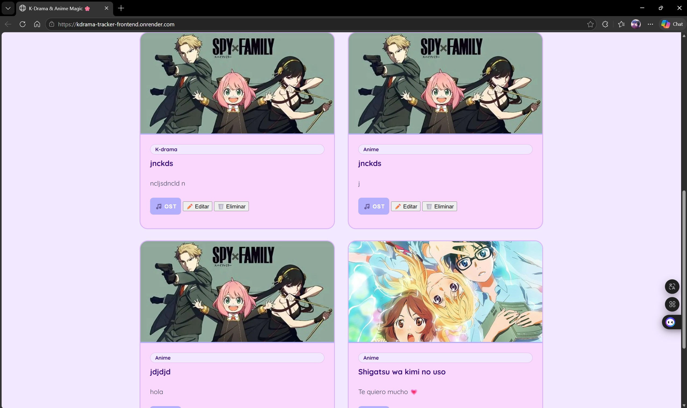

# ✨ My Magical Tracker - Client 🎀

Interfaz de usuario moderna y estética para gestionar tu lista de Animes y K-Dramas favoritos. Construido con JavaScript nativo para demostrar el dominio del DOM y la Fetch API.

## 🔗 Enlaces del Proyecto
- **Proyecto funcionando:** [Link a Render](https://kdrama-tracker-frontend.onrender.com/)
- **Repositorio Backend:** [Link al Backend](https://github.com/SarAvi21805/kdrama-tracker-backend)

## 📸 Captura de Pantalla

## 🏆 Challenges Implementados
1. **Calidad Visual (30 pts):** Diseño personalizado con múltiples temas (Sakura, Neutral, Dark) usando variables CSS.
2. **Historial de Git (20 pts):** Commits descriptivos siguiendo una progresión lógica de desarrollo.
3. **Organización del código (20 pts):** Arquitectura basada en componentes reutilizables y separación de servicios de API.
4. **Búsqueda por nombre (15 pts):** Filtro en tiempo real por título.
5. **Categorización (Extra):** Sistema de filtrado por K-Drama o Anime.

## 🚀 Tecnologías usadas
- HTML5 / CSS3 (Variables y Flexbox/Grid)
- JavaScript Vanilla (Módulos y Fetch API)
- **Sin librerías externas.**

## 💭 Reflexión sobre los desafíos
Trabajar con **JavaScript Vanilla** sin la ayuda de frameworks como React permite entender realmente cómo funciona el navegador. El mayor desafío fue mantener el estado de la aplicación sincronizado con el backend sin usar herramientas de gestión de estado complejas. Volvería a usar esta tecnología para proyectos pequeños donde la velocidad de carga inicial sea la prioridad, ya que el resultado es extremadamente ligero.

## 🛠️ Cómo correr localmente
1. Clonar el repositorio.
2. Abrir `index.html` usando un servidor local (ej: Live Server en VS Code).